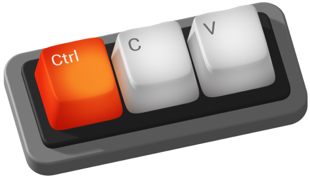

# Shortcuts

</img>

This Repo is a selection of useful shortcuts for both MacOS and Windows. Each section is divided in two parts Operational System Shortcuts and VS Code Shortcuts. Is true that google will have a million articles with shortcuts and features for MacOS, Windows and VS Code. However, this repo is based on the shortcuts used through Mission Ready Level 4 and 5 lessons. So you might relate with the solutions they bring to your daily needs on that matter.

It's a ongoing repo to help gather all those shortcuts. So eventually the list will grow and change for a better layout when we see fit. That said, if you want to contribute or if you spot any mistake flick me a message and we can collaborate to fix and make it even better.

[MacOS Shortcuts](./macos-shortcuts.md)

[Windows Shortcuts](./windows-shortcuts.md)

[VS Code Shortcuts](./vs-code-shortcuts.md)

# Other shortcut sources

One of my favourite source for shortcuts is DevHints, it covers not only shortcuts but also give cheatsheets on many development languages like CSS, HTML, etc.
[DevHints](https://devhints.io/)

And since I've started on the cheatsheets topic another one is OverAPI, it's essentially a collection of links made into a cheatsheet for several developers languages.
[OverAPI](https://overapi.com/)

<!--
    I've used LATEX Markdown syntax for some text colouring on this project. Just keeping a clear reference here for future use.
    $\textcolor{color}{\textsf{Text you want to display}}$
 -->
