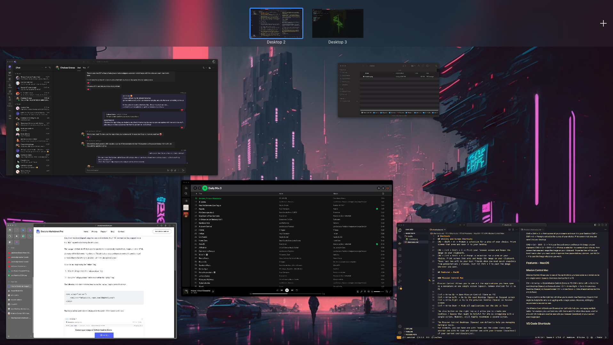

# MacOS - Shortcuts

## Utility and Screen Shortcuts

CMD + C -> Copy
CMD + V -> Paste
CMD + X -> Cut Selection to Clipboard
CMD + F -> Find Items in a document

CMD + T -> Open new tab (Useful on browsers)

Ctrl + CMD + F -> Use app in full screen (Focus Mode) If supported.
CMD + Tab -> Switch to "next" most recently used app
Option + CMD + Esc -> Force quit an app

CMD + , -> Open preferences for the app you're using (work on most applications)

CMD + Shift + 3 -> Print screen all your screens and save it to your Desktop
CMD + Shift + 4 -> Prompt a selection for a area of your choice. Print screen that area and save it to your Desktop

CMD + Ctrl + Shift + 3 -> Print your focused screen and keeps the image on your clipboard.
CMD + Ctrl + Shift + 4 -> Prompt a selection for a area of your choice. Print screen that area and keeps the image on your clipboard.
Those last two will be your best friends when you need quick snapshots from presentations / classes. Just hit Ctrl + V to past the image wherever you want.

## Features

### Mission Control

Mission Control Allows you to see all the applications you have open as a miniature on one single screen (space). Common shortcut for it is F3

Ctrl + Arrow Up -> Open Mission Control (Same as F3)
Ctrl + Arrow Left -> Go to the next Desktop (Space) on focused screen
Ctrl + Arrow Right -> Go to the previous Desktop (Space) on focused screen
Ctrl + Arrow Down -> Hide all applications but the one in focus

The plus button on the right top will allow you to create new Desktops / Spaces that might be helpful for who is struggling with a single screen. However, still highly recommend a second screen.

The Mission Control Desktops (Spaces) can definetly help you managing multiple tasks.
For example, you can have one with Teams and the video class open, another one with VS Code and another one with your browser (localhost) of your current exercise/project.
